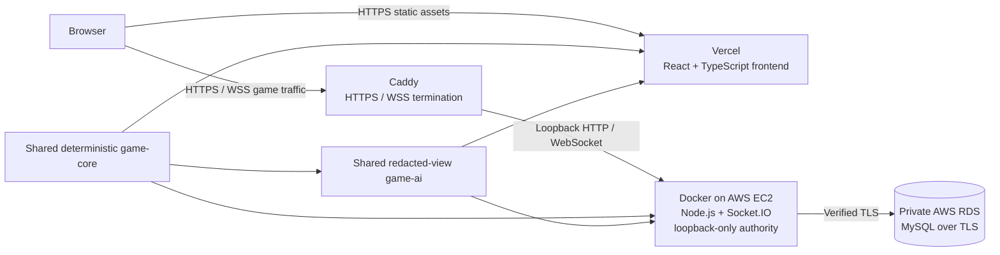

# Frontier Isles

Frontier Isles is an original full-stack multiplayer strategy board game built around deterministic rules, private player information, negotiation, resource management, and settlement building.

**Live demo:** [game.frankiesgroceryhk.shop](https://game.frankiesgroceryhk.shop)

**Compatibility URL:** [play.frankiesgroceryhk.shop](https://play.frankiesgroceryhk.shop)

The product combines a React + TypeScript client with a server-authoritative Node.js + Socket.IO backend, MySQL persistence, server-side AI, reconnect/resume, and a deterministic game engine. The live system runs on Vercel, Dockerized AWS EC2 infrastructure, private AWS RDS MySQL, and Caddy-managed HTTPS/WSS.

## Project overview

Frontier Isles supports both a self-contained Single Player experience and recoverable Online Multiplayer. The same pure TypeScript rules engine validates Human and AI commands in both modes, while the online server owns authoritative state and sends each participant a viewer-specific projection.

The implemented ruleset covers seeded board generation, initial placement, dice production, building, domestic and maritime trading, development cards, the robber and discard workflow, route and army awards, hidden information, and deterministic victory resolution.

## Key engineering features

- Deterministic seeded engine with immutable state transitions and no wall-clock or unseeded gameplay randomness
- Server-authoritative Online Multiplayer for two to four Humans, with remaining seats assignable to server-side AI
- Viewer-specific redacted `PlayerView` data for the browser and every AI agent
- Shared `game-core`, `game-ai`, and realtime-contract workspaces used by both frontend and backend
- Command IDs, canonical request fingerprints, bounded idempotent retries, and retained-result replay
- Serialized per-Room execution with independent Room queues and commit-before-publication ordering
- Reconnect/resume, authoritative resynchronization, disconnect pause, and Host-approved permanent AI replacement
- Exact restart recovery for game state, seeded RNG position, session ownership, publication revision, and retained command results
- MySQL aggregate persistence with restricted runtime privileges and TLS to private RDS
- Responsive Material UI controls and an accessible raw SVG board

## Architecture



Vercel serves the static client; realtime traffic originates in the browser and reaches the EC2 authority through Caddy. The frontend never connects to the database, and Caddy is the only public path to the loopback-bound Node service.

## Tech stack

| Area | Technologies |
| --- | --- |
| Frontend | React 19, TypeScript, Vite, Material UI, Zustand, raw SVG |
| Backend | Node.js 24, TypeScript, Socket.IO, Zod |
| Shared domain | TypeScript workspaces, immutable command engine, XORSHIFT32 seeded RNG |
| Persistence | MySQL 8-compatible storage through `mysql2`; SQLite remains available for local/reference operation |
| Infrastructure | Docker, AWS EC2, private AWS RDS MySQL, Caddy, Vercel |
| Quality | Vitest, Testing Library, Playwright, ESLint, TypeScript project builds, deterministic simulations |

## Game modes and gameplay

### Single Player

One Human plays against three AI personalities. The authoritative engine and AI run locally in the browser, and compatible games can be saved and resumed from local browser storage. Single Player does not require the online backend.

### Online Multiplayer

Two to four Humans join a four-seat Room; the Host may assign server-side AI to open seats. The backend owns the game, validates all actions, advances AI through the same command contracts, and publishes a distinct private view to each Human. Supported workflows include lobby readiness, full-game play, trading, reconnect/resume, resync, disconnect pause, AI replacement, restart recovery, and retained command replay.

## Reliability and multiplayer design

Each admitted online command carries a stable ID and expected state version. The browser retries the exact request within bounded limits; the server fingerprints it, serializes it through the Room's FIFO, and either replays the retained result or rejects conflicting reuse. Accepted state and the retained result commit before publication and acknowledgement, so a lost acknowledgement can be retried without applying the action or consuming seeded randomness twice.

Disconnects immediately pause authoritative progress. A valid session can resume within its server-owned deadline; after expiry, the connected Host may explicitly assign an AI profile to the same seat. On process restart, MySQL restores the exact aggregate before the server becomes ready, including pending decisions, state/RNG position, ownership, replacement state, and bounded idempotency data.

## Security and privacy boundaries

- The server derives actor authority from the attached Human session; client-supplied actor, Host, legality, resource, score, RNG, and revision claims grant no authority.
- Browsers and AI receive redacted `PlayerView` projections, never unrestricted opponent hands, hidden development cards, the deck, or the authoritative RNG cursor.
- Resume credentials are tab-scoped bearer values; only digests are persisted, and credentials are excluded from Room broadcasts and production diagnostics.
- The backend uses an exact-origin CORS allowlist. Wildcard and preview-origin authorization are not enabled.
- Public HTTPS/WSS terminates at Caddy; the Node service is bound to loopback, and its private RDS connection requires TLS certificate and hostname verification.
- The normal MySQL runtime account is limited to the operations needed by the aggregate repository. Privileged schema inspection/bootstrap is a separate one-shot process and never starts HTTP.
- Input sizes, Room/transport counts, command queues, receipts, retries, timers, logs, and persistence records are bounded and fail closed.

## Testing and verification

The accepted release source was reverified before this README update with:

```sh
npm run typecheck
npm run lint
npm run test
npm run build
npm run check
npm run simulate
```

Current root-suite result: **410 passing tests across 74 files** — 113 frontend/application tests, 261 `game-core` tests, and 36 `game-ai` tests. Type checking, zero-warning lint, and the production Vite build pass. The build reports the existing advisory that the main client chunk exceeds Vite's default 500 kB guidance.

The deterministic release simulation completed **100 games and 65,341 accepted commands**, checking invariants after every transition. Its reproducible summary hash is **`1adc49e8`**.

The repository also contains dedicated server, realtime-contract, recovery, security, MySQL, load, Socket.IO integration, container-smoke, and Playwright browser suites. See [testing](docs/TESTING.md), [online alpha testing](docs/v2/V2_ALPHA_TESTING.md), and [MySQL acceptance](docs/v2/V2_MYSQL_PROGRESS.md) for their scopes and operational prerequisites.

## Local development

Prerequisites: Node.js `>=24.19.0 <25` and a compatible npm 11 release.

```sh
npm ci
```

For Single Player, start the frontend only:

```sh
npm run dev:web
```

For Online Multiplayer development, run the frontend and server in separate terminals:

```sh
npm run dev:web
npm run dev:server
```

The local server defaults to `http://127.0.0.1:3001`, while Vite supplies the browser URL. Development defaults to local SQLite persistence; production uses MySQL. Copy values from [`.env.example`](.env.example) into your process environment only when overrides are needed. [`.env.production.example`](.env.production.example) and [`.env.mysql-production.example`](.env.mysql-production.example) contain non-secret deployment templates; never commit real credentials or infrastructure identifiers.

Useful aggregate commands:

```sh
npm run check
npm run check:server
npm run check:all
npm run simulate:online
```

## Repository structure

```text
packages/
  game-core/          Pure deterministic rules, state, selectors, and projections
  game-ai/            Redacted-view AI agents and simulation runners
  realtime-contracts/ Strict shared Socket.IO payload contracts
server/
  src/                Authoritative Rooms, game sessions, transport, and persistence
  test/               Server, recovery, security, load, and MySQL qualification
src/
  application/        Gateways, controllers, and Zustand session/UI stores
  infrastructure/     Browser persistence and realtime adapters
  ui/                 React/MUI screens, dialogs, panels, and raw SVG board
tests/e2e/             Playwright Single Player and Online Multiplayer workflows
deploy/                Deployment and operations reference
docs/                  Rules, architecture, ADRs, testing, security, and recovery
```

## Deployment architecture

| Surface | Live endpoint / role |
| --- | --- |
| Primary frontend | [game.frankiesgroceryhk.shop](https://game.frankiesgroceryhk.shop) |
| Compatibility frontend | [play.frankiesgroceryhk.shop](https://play.frankiesgroceryhk.shop) |
| Realtime backend | [game-api.frankiesgroceryhk.shop](https://game-api.frankiesgroceryhk.shop) |
| Static hosting | Vercel |
| Application authority | One Dockerized Node.js process on AWS EC2, exposed only through Caddy |
| Durable storage | Private AWS RDS MySQL with required TLS |

The frontend build targets the exact backend origin and a restrictive `connect-src` policy. Caddy handles public HTTPS/WSS and forwards HTTP/1.1 and Socket.IO traffic to the loopback service. Production MySQL configuration is backend-only; database endpoints, credentials, AWS identifiers, and network topology details are intentionally absent from the repository.

## Project status and limitations

The current release is publicly playable and supports complete Single Player and Online Multiplayer games. The package version remains `2.0.0-alpha.1`, reflecting deliberate product limits: no user accounts, matchmaking, chat, spectators, rankings, Human seat transfer, cross-region failover, or multiple authoritative server replicas. Room codes are coordination keys, not private invitations, and finite rate/capacity limits are safety boundaries rather than distributed denial-of-service protection.

The deployment uses one authoritative backend process and requires operator-managed database backup, restore, monitoring, and recovery. Phone portrait polish is not a release target, and client bundle code-splitting remains an identified optimization.

## Original work and attribution

Frontier Isles uses original source code, branding, interface design, and visual assets. It is inspired by the broader genre of hex-board resource and trading games, but it is not affiliated with or endorsed by CATAN or its rights holders. The repository does not include official logos, artwork, card images, or copied rulebook presentation.
